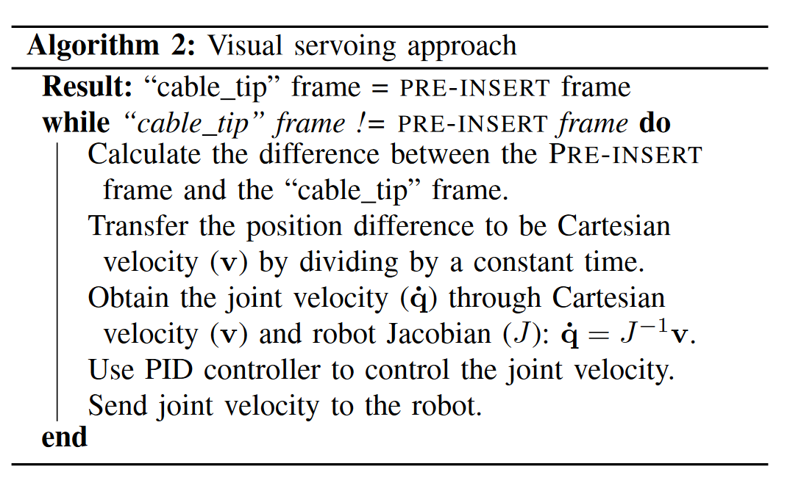
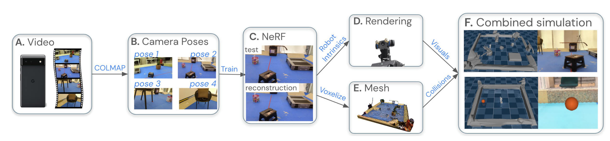
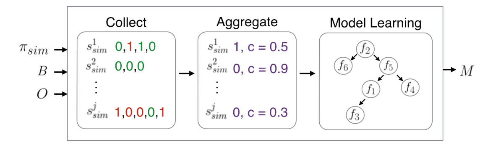
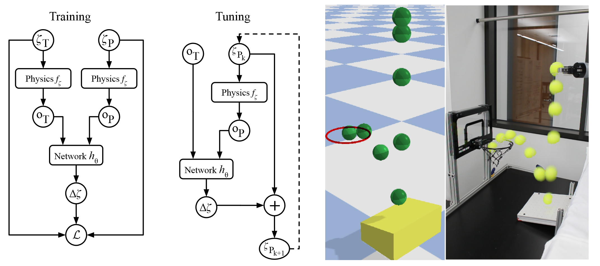
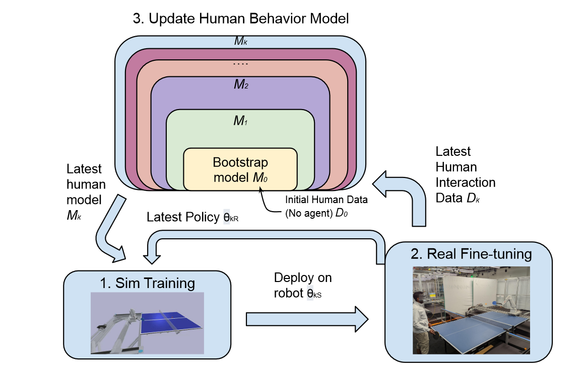

## Domain Randomization

Domain Randomization is a powerful technique used in Sim2Real (Simulation to Reality) applications to bridge the gap between simulated and real environments. Its effectiveness lies in its ability to prepare models, especially those based on machine learning and reinforcement learning, to handle the unpredictability and variability of the real world. By introducing a wide range of variations in the simulation (like lighting conditions, object textures, and physical properties), domain randomization exposes the model to a broader spectrum of scenarios than it might encounter in the real world.

### Method

- [ ] [Reinforcement Learning with Adaptive Curriculum Dynamics Randomization for Fault-Tolerant Robot Control](https://arxiv.org/abs/2111.10005)

  **random actuator failures**

  The research focuses on improving the fault tolerance of quadruped robots to actuator 	failure using an Adaptive Curriculum Reinforcement Learning algorithm with Dynamics Randomization (ACDR). This method trains robots to handle random actuator failures, developing a robust control policy without needing separate failure detection or policy switching mechanisms. 

- [ ] [Crossing the Gap: A Deep Dive into Zero-Shot Sim-to-Real Transfer for Dynamics](https://ieeexplore.ieee.org/abstract/document/9341617?casa_token=kahI3DOTdtgAAAAA:ACANVD-saqdfmasVpnjfzZv2TZ7hzSc0t8DQ96ruMOj6JR3k9faeHs3uf_Q7q7wYs0Qd4hhveg)

  **random force**

  

- [ ] The key method explored is Random Force Injection (RFI), which involves injecting random noise into a simulated environment with fixed dynamics parameters. This approach contrasts with the more complex and commonly used domain randomisation method, which involves randomising a wide range of simulation parameters like physical and control parameters. RFI stands out for its simplicity, effectiveness, and ease of implementation, requiring significantly less tuning and engineering effort compared to domain randomisation.

### Investigation

- [ ] [Dynamics randomization revisited: A case study for quadrupedal locomotion](https://ieeexplore.ieee.org/abstract/document/9560837?casa_token=yphRgw3TAuMAAAAA:gIwqpF0vq51bQ-1Tzm3C6ZyWFd4KlmzmHjAJE4o9fGy6KN9TLhx_PCNiUg5lp21DU12tzZVECA)

  **proper domain random**

  

  The study concludes that applying dynamics randomization blindly, when not required, can lead to suboptimal, overly conservative policies. However, it remains necessary in cases where fundamental modeling errors hinder sim-to-real transfer success, like in their latency experiments. The authors suggest employing dynamics randomization or additional modeling only when significant modeling errors are present, and it's crucial to randomize or model only those parameters that are critical. Unnecessary randomization can detrimentally affect performance without adding any benefits in robustness

- [ ] [Analysis of Randomization Effects on Sim2Real Transfer in Reinforcement Learning for Robotic Manipulation Tasks]()

  **proper domain random too**

  Their findings reveal that while increased randomization can facilitate Sim2Real transfer, it may also impede policy optimization in simulation; they also find that full randomization and fine-tuning yield the best real-world performance.

## High-Fidelity Simulation

Since the high-fedelity simulation can provide detailed and accurate representation of real-world environments.

- [ ] [Closing the Sim-to-Real Loop: Adapting Simulation Randomization with Real World Experience](https://ieeexplore.ieee.org/abstract/document/8793789?casa_token=BYg3gfZC2ZgAAAAA:cY2h-nusTELbjyc8YsOstIolZ-5PhXDF4Bg3ryvNhxID68D7UC4x0rrR1gLnWo1f3_Lp6lSR_g)

  **simulation parameters, few world trials**

  

  The study addresses transferring simulated training policies to real-world robotics by dynamically adjusting the simulation parameters based on a small number of real-world trials. This adaptive method aligns simulated policy behavior more closely with actual performance, enhancing the real-world transferability of the trained policies.

- [ ] [Sim-to-real: Learning agile locomotion for quadruped robots](https://arxiv.org/abs/1804.10332)

  **traditional method**

  The approach enhances simulation fidelity with **system identification**, **precise actuator modeling**, and **latency simulation**. Robust control is achieved by varying the simulation environment, introducing **disturbances**, and utilizing a streamlined observation space

- [ ] [Sim2Real2Sim: Bridging the Gap Between Simulation and Real-World in Flexible Object Manipulation](https://ieeexplore.ieee.org/abstract/document/9287921?casa_token=qKgRLYO7UP4AAAAA:YlgsFqqgCWHFbMZ9idWOA8zWcylL5jz-gZU_uSJ52OVkh1FoJ3-Sabbqj37i88a1dttBUBuIHQ)

  **visual feedback**

  

  

  

  Sim2Real2Sim adds an essential step of feedback and refinement.
  What makes Sim2Real2Sim innovative is its additional phase of refining the simulation models based on real-world data and experiences. After the initial transfer from simulation to the real world, the observed differences and inaccuracies in the real-world application are used to update and improve the simulation models. This process creates a feedback loop where the simulation continuously evolves and becomes more accurate and representative of the real world.

- [ ] [Modelling generalized forces with reinforcement learning for sim-to-real transfer](https://arxiv.org/abs/1910.09471)

  **optimize gfm model by interacting with environment**

  

  First, Train an agent in simulation with the original model parameters. Second, use the agent trained in step 1 to collect real world data. Third, learn the generalized force model (GFM): initialize the simulation to the initial state of a real world trajectory and simulate forward, choosing the same actions taken on the real robot. The GFM injects generalized forces into the simulation with the objective of minimizing the difference between the real world and simulation states. Last, Retrain the agent for solving the task of interest using the updated hybrid model.

- [ ] [Learning active task-oriented exploration policies for bridging the sim-to-real gap](https://arxiv.org/abs/2006.01952)

  **learn SimOpt and sim TrajOpt**

  

  Proposed framework of active, task-oriented exploration policies. An exploration policy generates real-world trajectories, which is then used by an optimizer to identify the dynamics parameters (SimOpt). Model-based trajectory optimization uses these parameters to find a task policy (TrajOpt), which then performs the task in the real world. 

- [ ] [Unsupervised domain adaptation with dynamics-aware rewards in reinforcement learning](https://proceedings.neurips.cc/paper_files/paper/2021/hash/f187a23c3ee681ef6913f31fd6d6446b-Abstract.html)

- [ ] 

  - $\text{max}~\mathbb E_{\mathcal {B_S}}[\text{log}~q_\psi^{sas}(\text{source}|s_t,a_t,s_{t+1})] + \mathbb E_{\mathcal {B_T}}[\text{log}~q^{sas}(\text{target}|s_t,a_t,s_{t+1})]$
  - $\text{max}~\mathbb E_{\mathcal {B_S}}[\text{log~}q_\psi^{sa}(\text{source}|s_t,a_t)]+\mathbb E_{\mathcal {B_T}}[\text{log}~q_\psi^{sa}(\text{target}|s_t,a_t)]$
  - $\Delta r(s_t,a_t,s_{t+1}) = \text{log}\frac{q_\psi^{sas}(\text{source}|s_t,a_t,s_{t+1})}{q_\psi^{sa}(\text{target}|s_t,a_t,s_{+1})}-\text{log}\frac{q_\psi^{sa}(\text{source}|s_t,a_t)}{q_\psi^{sa}(\text{target}|s_t,a_t)}$

  The authors propose a method that involves unsupervised domain adaptation with dynamics-aware rewards (DARS). This approach addresses the issue of dynamics shifts between different environments (source and target) that can inhibit direct skill transfer. The key innovation is the introduction of a KL (Kullback-Leibler) regularization, which modifies the reward function in standard unsupervised RL to align trajectories induced in the target environment with those in the source environment. This strategy encourages the emergence of skills that are adaptable across different dynamics, making the learning process more efficient and effective in various environments.

- [ ] [Sim2Real Predictivity: Does Evaluation in Simulation Predict Real-World Performance?](https://ieeexplore.ieee.org/abstract/document/9158349?casa_token=rfkpcGKfLl4AAAAA:9wCizUDY4c567eO0o7POKb1FE8gBKJe6aR6UOFAEclMevrDvxo5Idz8fxO-PstzCWoyNEajqOg)
  The paper indicating that simulator performance doesn't necessarily translate to the real world, often due to agents exploiting simulator flaws. It suggesting that careful tuning of simulations can make in-simulation testing more indicative of real-world performance

- [ ] [Learning Bipedal Walking for Humanoids With Current Feedback](https://ieeexplore.ieee.org/abstract/document/10201853)

  

  It introduces a novel method of simulating back-electromotive force (back-EMF) and employing current feedback from actuators during the training process. This approach significantly improves the sim2real transfer, enabling the robot to achieve dynamic walking, stepping, and turning movements.

- [ ] [Nerf2real: Sim2real transfer of vision-guided bipedal motion skills using neural radiance fields](https://ieeexplore.ieee.org/abstract/document/10161544?casa_token=oQw3teIEj7oAAAAA:20jGq2yt8H4WXwls6y4UM1NHfV29A8yZaCWaZb21MPBeb3pSQ-5VhDXn2T9SppNYCyr49L_yEQ)

  **nerf**

  

  This method enables the creation of photorealistic simulation environments from real-world scenes, captured simply using mobile cameras. The paper demonstrates the effective training and transfer of vision-based navigation and interaction policies for humanoid robots in these environments. 

- [ ] [Safety-Critical Controller Verification via Sim2Real Gap Quantification](https://ieeexplore.ieee.org/abstract/document/10161126?casa_token=yCF1f0R1Lq0AAAAA:xo21Cx53gsrg0mB7SfS8lFxmWvfgBTlWyQdvoWxFACMJjHAoMVwlxsPfTrfBeibqRw8u96Bu6A)

  

  The authors have developed a method to detect and measure the discrepancies between simulation models and real-world system behavior, known as the sim2real gap. By incorporating this measured gap into their simulations, they create an "uncertain model" that more closely reflects reality. This model is then used to design and test controllers in the simulated environment with a probabilistic approach that ensures their effectiveness and reliability in the real world.

- [ ] [Auto-tuned sim-to-real transfer](https://ieeexplore.ieee.org/abstract/document/9562091?casa_token=UVHKggFtRusAAAAA:TMmJo8MCWVG8EjiwmWRs9fR6moQ_3f9o5ngzyxzhOd0eGov085S_Tyk86BvDQODXAjZ6lKr25g)

  

  introduces a novel approach to sim-to-real transfer in robotics, focusing on automatically tuning simulation parameters to closely match real-world conditions. The paper presents a unique Search Param Model (SPM) that uses real-world visual observations to adjust simulation parameters effectively.

- [ ] [LiDAR Sensor modeling and Data augmentation with GANs for Autonomous driving](https://arxiv.org/pdf/1905.07290.pdf)

  **cycle-GAN**

  $$\text{Realistic LiDAR Data}=\text{CycleGAN}(\text{Simulated LiDAR Data},\text{Real-world LiDAR Features})$$

  The core of the paper is the formulation of the problem as an  image-to-image translation from unpaired data using CycleGANs. This  approach is used to solve the sensor modeling problem for LiDAR,  enabling the production of realistic LiDAR data from simulated LiDAR  (sim2real) and generating high-resolution realistic LiDAR from lower  resolution data (real2real).

- [ ] [UniSim: A Neural Closed-Loop Sensor Simulator](https://openaccess.thecvf.com/content/CVPR2023/papers/Yang_UniSim_A_Neural_Closed-Loop_Sensor_Simulator_CVPR_2023_paper.pdf)

  

  They divide the 3D scene into a static background (grey) and a set of dynamic actors (red). Then query the neural feature fields separately for static background and dynamic actor models, and perform volume rendering to generate neural feature descriptors. We model the static scene with a sparse feature-grid and use a hypernetwork to generate the representation of each actor from a learnable latent. We finally use a convolutional network to decode feature patches into an image

## Generalized and Robust Model

- [ ] [Reinforcement learning with perturbed rewards](https://ojs.aaai.org/index.php/AAAI/article/view/6086)

This paper presents a robust framework for addressing the issue of noisy reward signals in robotics, a common problem when transferring reinforcement learning models from sim2real. The authors develop a method to compensate for perturbed rewards without assuming noise distribution, demonstrating enhanced real-world performance of robotic systems with improved convergence in noisy environments.

1. [Sim-to-real via sim-to-sim: Data-efficient robotic grasping via randomized-to-canonical adaptation networks](https://openaccess.thecvf.com/content_CVPR_2019/html/James_Sim-To-Real_via_Sim-To-Sim_Data-Efficient_Robotic_Grasping_via_Randomized-To-Canonical_Adaptation_Networks_CVPR_2019_paper.html)

   

   The study presents a novel approach called Randomized-to-Canonical Adaptation Networks (RCAN) for sim-to-real transfer in robotics. The method works by transforming randomized simulation images into non-randomized canonical versions. This allows for the training of a robot grasping algorithm in simulation, which can then be transferred to operate in the real world without the need for real-world data. This is achieved by training the RCAN model to convert real-world images into the canonical simulation domain. The study demonstrates that this approach outperforms direct domain randomization and allows for significant data efficiency, requiring less real-world training data than conventional methods. RCAN is also reported to have the advantage of providing an interpretable intermediate output, which is not available with direct domain randomization approaches.

2. [DiAReL: Reinforcement Learning with Disturbance Awareness for Robust Sim2Real Policy Transfer in Robot Control](https://arxiv.org/abs/2306.09010)

   

   involves the introduction of a Disturbance-Augmented Markov Decision Process (DAMDP). This approach augments the state space of reinforcement learning (RL) agents with estimated disturbances, enhancing the robustness of the control policy. It specifically addresses challenges in environments with delays in observation or action, focusing on improving sim2real transfer for robot control. The method employs data-driven disturbance estimation integrated into the agent's observation space, allowing for more effective and robust policy training in simulated environments, which can then be transferred to real-world robotic applications.

3. [How to sim2real with gaussian processes: Prior mean versus kernels as priors](https://www.diva-portal.org/smash/record.jsf?pid=diva2%3A1565302&dswid=-2444)

   the paper argues for a more flexible approach by embedding prior knowledge into GP kernels. This kernel-centric method is seen as more adaptable in capturing simulation-based information and provides robustness against sim2real mismatches.

4. [Learning vision-guided quadrupedal locomotion end-to-end with cross-modal transformers](https://arxiv.org/abs/2107.03996)

   **multi-modal model**

   

   The paper proposes a novel method for improving quadrupedal robot locomotion through the integration of proprioceptive states and visual inputs using a cross-modal Transformer in Reinforcement Learning (RL) policies. The key innovation is the LocoTransformer model, which combines proprioceptive data (like robot pose, Inertial Measurement Unit readings, and joint rotations) with visual information from a depth camera. This fusion provides a comprehensive understanding of the robot's environment, enhancing its ability to navigate complex terrain and avoid obstacles.

5. [Trustworthy Reinforcement Learning Against Intrinsic Vulnerabilities:Robustness, Safety, and Generalizability](https://arxiv.org/abs/2209.08025)

   **robust rl**

   This involves improving worst-case performance in scenarios where training and testing conditions differ significantly, such as in autonomous driving or when dealing with varying physical parameters in control tasks. A key aspect of their approach is handling mismatches between observed and actual states, often caused by sensor errors or limitations, which is critical for maintaining safety and performance in real-world applications. The study also discusses training methodologies, including adversarial training, to make RL algorithms more robust and prevent overly conservative policy outcomes, ensuring their reliability in diverse and challenging environments.

6. [Discovering blind spots in reinforcement learning](https://arxiv.org/abs/1805.08966)

   **identify insufficient state**

   

   

   This paper proposes a method to identify and predict 'blind spots' in reinforcement learning (RL) agents that occur due to insufficient state representations, which can lead to costly mistakes when agents trained in simulation are deployed in the real world. To tackle this, the authors have developed a predictive model that uses oracle feedback—such as demonstrations and corrections—to learn about these blind spots.

7. [Tunenet: One-shot residual tuning for system identification and sim-to-real robot task transfer](http://proceedings.mlr.press/v100/allevato20a.html)

   **meta learning : tune-net**

   

   TuneNet, a machine-learning-based method is designed to bridge the gap between simulated and real-world environments for robot training purposes. It uses an iterative residual tuning technique that can adjust the parameters of a simulation model to more closely match the real world with just a single observation from the target environment and minimal simulation effort.

8. [Sim2Real Transfer for Reinforcement Learning without Dynamics Randomization](https://ieeexplore.ieee.org/abstract/document/9341260?casa_token=jGFad_P1MHUAAAAA:UYMglcjn4Wzra6j-oI3HlbBk6YUUmu7PUzwzHcOuebdkYImGq9LNftVFRB5BMm7YOFGSnYy48g)

   **Operational Space Control**

   The framework utilizes Operational Space Control (OSC) under joint and Cartesian constraints for reinforcement learning in Cartesian space. This approach allows for fast learning with adjustable degrees of freedom and enables safe learning on real robots or flexible goal-conditioned policies that can be easily transferred from simulation to the real robot

9. [Preparing for the unknown: Learning a universal policy with online system identification](https://arxiv.org/abs/1702.02453)

   **UP - OSI**

   

   introduces a novel method for learning control policies that operate under unknown dynamic models. This method leverages a large number of training examples generated using a physical simulator and consists of two key components:

   - **Universal Policy (UP)**This control policy is universal because it is trained over a wide array of dynamic models, encompassing variations in mass, inertia, friction coefficients, and other parameters. By training the UP with such variations, the policy is prepared to handle a wide range of conditions in unknown environments.
   - **Online System Identification (OSI)**The OSI function predicts the dynamic model parameters based on the recent state and action history. This prediction is then used as input to the UP, along with the system state, creating a robust control policy adaptable to a wide range of dynamic models and responsive to sudden environmental changes.

10. [Deep Whole-Body Control: Learning a Unified Policy for Manipulation and Locomotion](https://proceedings.mlr.press/v205/fu23a.html)

    **Advantage Mixing and Regularized Online Adaptation**

    

    - **Advantage Mixing** : $J(\theta)=\frac{1}{|\mathcal D|}\sum_{(s_t,a_t)\in \mathcal D}\text{log}\pi(a^{\text{arm}}_t|s_t)(A^{\text{manip}}+\beta A^{\text{loco}})+\text{log}\pi(a_t^{\text{leg}}|s_t)(\beta A^{\text{manip}}+A^{\text{loco}})$
    - **Regularized Online Adaption** : $L(\theta_\pi,\theta_\mu,\theta_\phi) = -J(\theta_\pi,\theta_\mu ) + \lambda \Vert z^\mu - \text{sg}[z^\phi]\Vert_2 +\Vert \text{sg}[z^\mu]-z^\phi\Vert_2$

    To address the challenge of training a robust policy for a high-DoF robot, the researchers use Advantage Mixing. This method exploits the causal structure in action space, relating arm actions to manipulation tasks and leg actions to locomotion tasks. This approach simplifies the training process and accelerates learning.

    The paper also introduces a method for Sim-to-Real transfer called Regularized Online Adaptation. This method eschews the traditional two-phase teacher-student scheme, using an adaptation module that estimates environment extrinsics based on onboard sensory observations. This approach aims to bridge the gap between simulated training environments and real-world conditions.

11. [Sim-to-real: Quadruped Robot Control with Deep Reinforcement Learning and Parallel Training](https://ieeexplore.ieee.org/abstract/document/10011921)

    

    The approach proposes an end-to-end neural network framework that includes an estimator network for estimating the robot's ontology states, in addition to critic and actor networks. These networks are key components in creating a robust control system for the quadruped robot, enhancing its adaptability and stability

12. [i-Sim2Real: Reinforcement Learning of Robotic Policies in Tight Human-Robot Interaction Loops](https://proceedings.mlr.press/v205/abeyruwan23a.html)

    

    The i-S2R framework is an iterative learning process that alternates between simulation and real-world deployment. It starts with a coarse model of human behavior and refines both the human behavior model and the robot's policy iteratively through successive rounds of simulation and real-world interaction.

13. [Adaptability preserving domain decomposition for stabilizing sim2real reinforcement learning](https://ieeexplore.ieee.org/abstract/document/9341124?casa_token=FGwsOIdemZgAAAAA:Ua5r3OY7a9Jq918-Thrl-BHQ2435fAX8DJsPr3IdN7iBQo2nhVni9vd81za0nQhGCo8ylFUpuw)

    

     presents an innovative Domain Decomposition (DD) algorithm that stabilizes sim2real reinforcement learning by training separate policies for different simulated environments. This method maintains the adaptability of the overall policy while enhancing training stability. The paper introduces an environment identifier to classify simulation environments for targeted training and theoretically proves the preservation of adaptability in RL policies.

## Limited Hardware and Interaction

1. [Towards Closing the Sim-to-Real Gap in Collaborative Multi-Robot Deep Reinforcement Learning](https://ieeexplore.ieee.org/abstract/document/9310796?casa_token=qGDV_tCatxMAAAAA:5zBHDB7jau8xnP5qx41yhNKzehK1gjID4hLRhxDWLTw8EXajnt4ZpV48DTVZqVsk4J2hT9nlVg)

   

   use Multiple-agent to learn the same task with sharing policy 

2. [Sim2Real Transfer for Deep Reinforcement Learning with Stochastic State Transition Delays](https://proceedings.mlr.press/v155/sandha21a.html)

   **time deplay, sampling rate**

   

   The paper discusses the challenge of Sim2Real transfer in Deep Reinforcement Learning (RL) for robotics, particularly due to variations in sensor sampling rates and actuation delays. It points out the limitations of domain randomization in addressing the inconsistencies in state transition delays during real-world deployment. Introducing the Time-in-State RL (TSRL) approach, which incorporates timing delays and sampling rates into the training observations, the study shows improved robustness of Deep RL policies.

3. [Closing the Sim-to-Real Gap for Ultra-Low-Cost, Resource-Constrained, Quadruped Robot Platforms](http://jabbourjason.com/pubs/Closing_the_sim-to-real_gap_for_ultra-low-cost.pdf)

   

   

   adapts imitation learning pipelines to ultra-low-cost robots with poor actuation, limited computing resources, and limited sensors; and propose practical solutions to overcome these difficulties. These initial steps help lay the groundwork for a future with globally-accessible, capable, ultra-low-cost robots