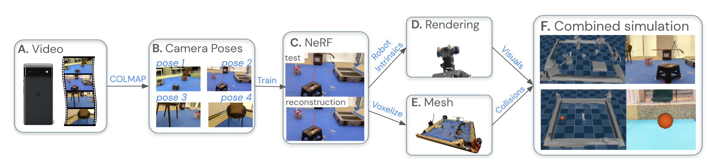
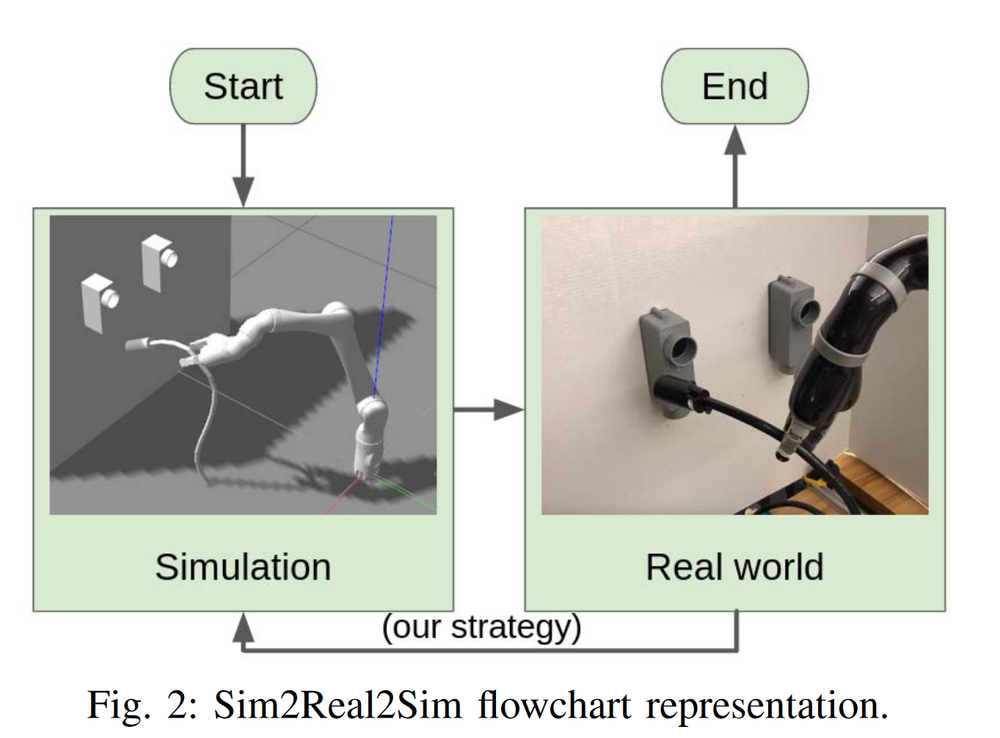
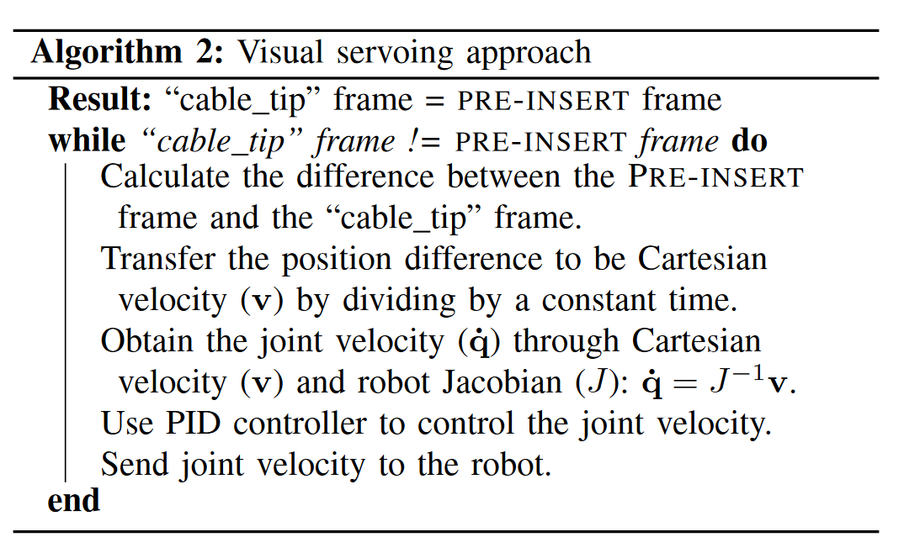
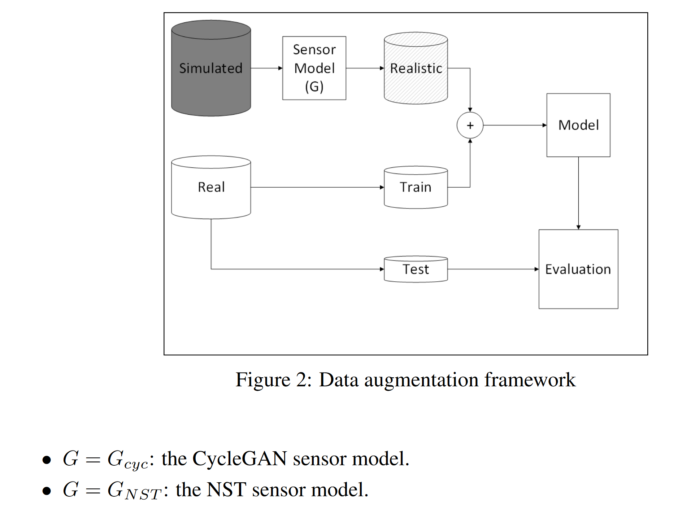
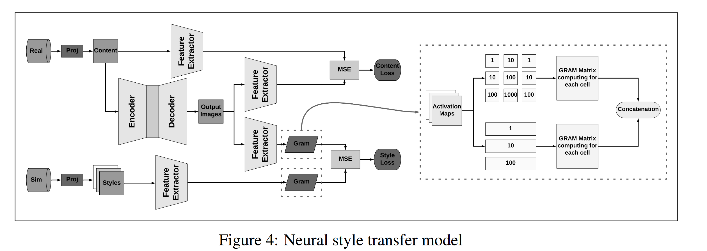
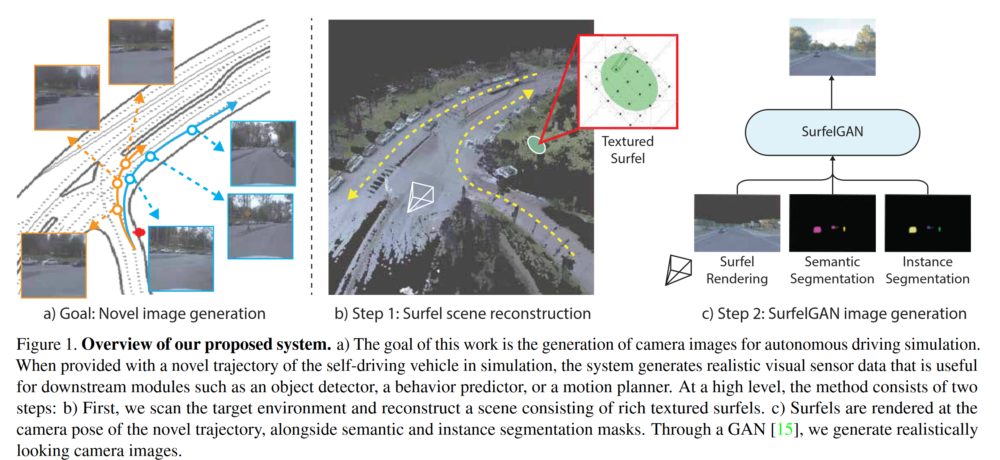
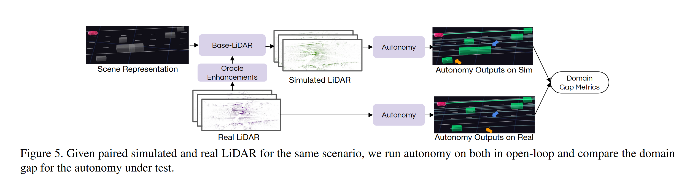
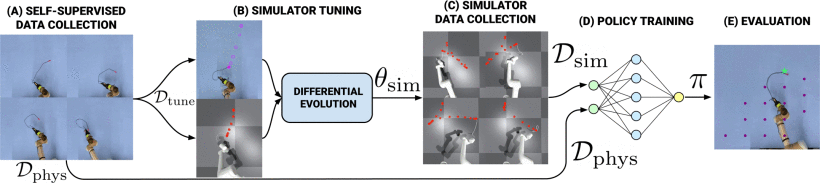

- [Nerf2real: Sim2real transfer of vision-guided bipedal motion skills using neural radiance fields](https://ieeexplore.ieee.org/abstract/document/10161544?casa_token=oQw3teIEj7oAAAAA:20jGq2yt8H4WXwls6y4UM1NHfV29A8yZaCWaZb21MPBeb3pSQ-5VhDXn2T9SppNYCyr49L_yEQ)

  **nerf**

  

  This method enables the creation of photorealistic simulation environments from real-world scenes, captured simply using mobile cameras. The paper demonstrates the effective training and transfer of vision-based navigation and interaction policies for humanoid robots in these environments. 

- [Sim2Real2Sim: Bridging the Gap Between Simulation and Real-World in Flexible Object Manipulation](https://ieeexplore.ieee.org/abstract/document/9287921?casa_token=qKgRLYO7UP4AAAAA:YlgsFqqgCWHFbMZ9idWOA8zWcylL5jz-gZU_uSJ52OVkh1FoJ3-Sabbqj37i88a1dttBUBuIHQ)

  **visual feedback**

  

  

  

  Sim2Real2Sim adds an essential step of feedback and refinement.
  What makes Sim2Real2Sim innovative is its additional phase of refining the simulation models based on real-world data and experiences. After the initial transfer from simulation to the real world, the observed differences and inaccuracies in the real-world application are used to update and improve the simulation models. This process creates a feedback loop where the simulation continuously evolves and becomes more accurate and representative of the real world.

- [LiDAR Sensor modeling and Data augmentation with GANs for Autonomous driving](https://arxiv.org/pdf/1905.07290.pdf)

  **cycle-GAN**

  $$\text{Realistic LiDAR Data}=\text{CycleGAN}(\text{Simulated LiDAR Data},\text{Real-world LiDAR Features})$$

  The core of the paper is the formulation of the problem as an  image-to-image translation from unpaired data using CycleGANs. This  approach is used to solve the sensor modeling problem for LiDAR,  enabling the production of realistic LiDAR data from simulated LiDAR  (sim2real) and generating high-resolution realistic LiDAR from lower  resolution data (real2real).

- [UniSim: A Neural Closed-Loop Sensor Simulator](https://openaccess.thecvf.com/content/CVPR2023/papers/Yang_UniSim_A_Neural_Closed-Loop_Sensor_Simulator_CVPR_2023_paper.pdf)

  

  They divide the 3D scene into a static background (grey) and a set of dynamic actors (red). Then query the neural feature fields separately for static background and dynamic actor models, and perform volume rendering to generate neural feature descriptors. We model the static scene with a sparse feature-grid and use a hypernetwork to generate the representation of each actor from a learnable latent. We finally use a convolutional network to decode feature patches into an image

- [Unsupervised Neural Sensor Models for Synthetic LiDAR Data Augmentation](https://arxiv.org/pdf/1911.10575.pdf)

  **Data Augment**

  

  - Cyecle GAN : $\underset{G,F}{\text{argmin}}~\underset{D_X,D_Y}{\text{max}} \mathcal L_{GAN}(G,D_Y,X,Y)+\mathcal L_{GAN}(F,D_X,X,Y)+\lambda[\mathcal L_{R_Y}(G,F,Y)+\mathcal L_{R_X}(F,G,X)]$
    - $X, Y$ : original / real data  
    - $G,F$ : forward/ backward network, $G:X\to Y, F:Y\to X$
    - $D_X,D_Y$ : discriminators 
  - NST : $\underset{G}{\text{argmin}}~\underbrace{ \lambda _s\mathcal L_s(p)}_{\text{style loss}}+\underbrace{\lambda_c\mathcal L_c (p)}_{\text{content loss}}$
    - $p$ : generated image

  

  

  two main neural sensor models (NSMs) for LiDAR data augmentation using synthetic data: CycleGAN and Neural Style Transfer (NST).

- [LiDAR Data Noise Models and Methodology for Sim-to-Real Domain Generalization and Adaptation in Autonomous Driving Perception](https://ieeexplore.ieee.org/abstract/document/9576034?casa_token=GtXRx-HHKN0AAAAA:2Bq5SCP_NTqeJl1R7K-cfTeMTSPpWuJV-XrRJUmiu8uBgiyFJ80YOV4Ogw-UWPpvImDRGmKjhQ)
  $$
  \text{Training Set} = \text{Error Model}(\text{Simulated Data})
  $$

  $$
  \text{Error Model} = \text{Noise Model} + \text{Point Dropout Model}
  $$

  **Domain random**

  In the learning process of the study, the sensor error modeling is used  to make the simulated LiDAR data more realistic by introducing noise and point dropout, as described by the noise and dropout models. This  process helps in training the neural networks to be more robust to the  imperfections commonly found in real-world LiDAR data. 

- [SurfelGAN: Synthesizing Realistic Sensor Data for Autonomous Driving](https://openaccess.thecvf.com/content_CVPR_2020/html/Yang_SurfelGAN_Synthesizing_Realistic_Sensor_Data_for_Autonomous_Driving_CVPR_2020_paper.html)

  **Synthetic Dataset**

  

- [Towards Zero Domain Gap: A Comprehensive Study of Realistic LiDAR Simulation for Autonomy Testing](https://openaccess.thecvf.com/content/ICCV2023/html/Manivasagam_Towards_Zero_Domain_Gap_A_Comprehensive_Study_of_Realistic_LiDAR_ICCV_2023_paper.html)

  **gap evaluation**

  

  proposes a novel "paired-scenario" approach for evaluating the domain  gap in LiDAR simulators. This involves reconstructing digital twins of  real-world scenarios, then simulating LiDAR data in these scenarios and  comparing it with actual LiDAR data. The study focuses on how different  aspects of LiDAR simulation, like pulse phenomena, scanning effects, and asset quality, affect the domain gap in relation to an autonomy  system's perception, prediction, and motion planning capabilities.

- [Real2Sim2Real: Self-Supervised Learning of Physical Single-Step Dynamic Actions for Planar Robot Casting](https://ieeexplore.ieee.org/abstract/document/9811651?casa_token=SxdetTyMKtwAAAAA:bFLA3RhAEgzMdwbqSwBk9a37yYr3Dh356vYt0-nc4cKDooO1vcrk_QDkQPtN7RmlNr1Cxum27Q)

  

   The Real2Sim2Real framework proposed in this paper is self-supervised  and focuses on efficiently learning a PRC( Planar Robot Casting) policy for different types of  cables. It does so by collecting physical trajectory data, using these  to tune the parameters of a dynamics simulator through Differential  Evolution, and then generating simulated examples. The learning policy  is derived from a weighted combination of both simulated and physical  data. The methodology was tested using three different simulators and  two function approximators (Gaussian Processes and Neural Networks) on  cables with varying physical properties. 

- 

