## RGB Camera

[Nerf2real: Sim2real transfer of vision-guided bipedal motion skills using neural radiance fields](https://ieeexplore.ieee.org/abstract/document/10161544?casa_token=oQw3teIEj7oAAAAA:20jGq2yt8H4WXwls6y4UM1NHfV29A8yZaCWaZb21MPBeb3pSQ-5VhDXn2T9SppNYCyr49L_yEQ)

**Neural Field**

Sensor : Camera (Phone)

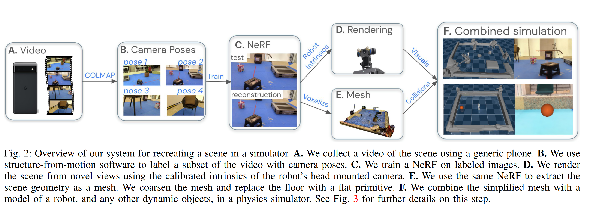

This method enables the creation of photorealistic simulation environments from real-world scenes, captured simply using mobile cameras. The paper demonstrates the effective training and transfer of vision-based navigation and interaction policies for humanoid robots in these environments. 

[UniSim: A Neural Closed-Loop Sensor Simulator](https://openaccess.thecvf.com/content/CVPR2023/papers/Yang_UniSim_A_Neural_Closed-Loop_Sensor_Simulator_CVPR_2023_paper.pdf)

**Neural Field**

Sensor : Camera & LiDAR
$$
\text{3D World} = \text{Static Background} + \text{Moving Actors}
$$

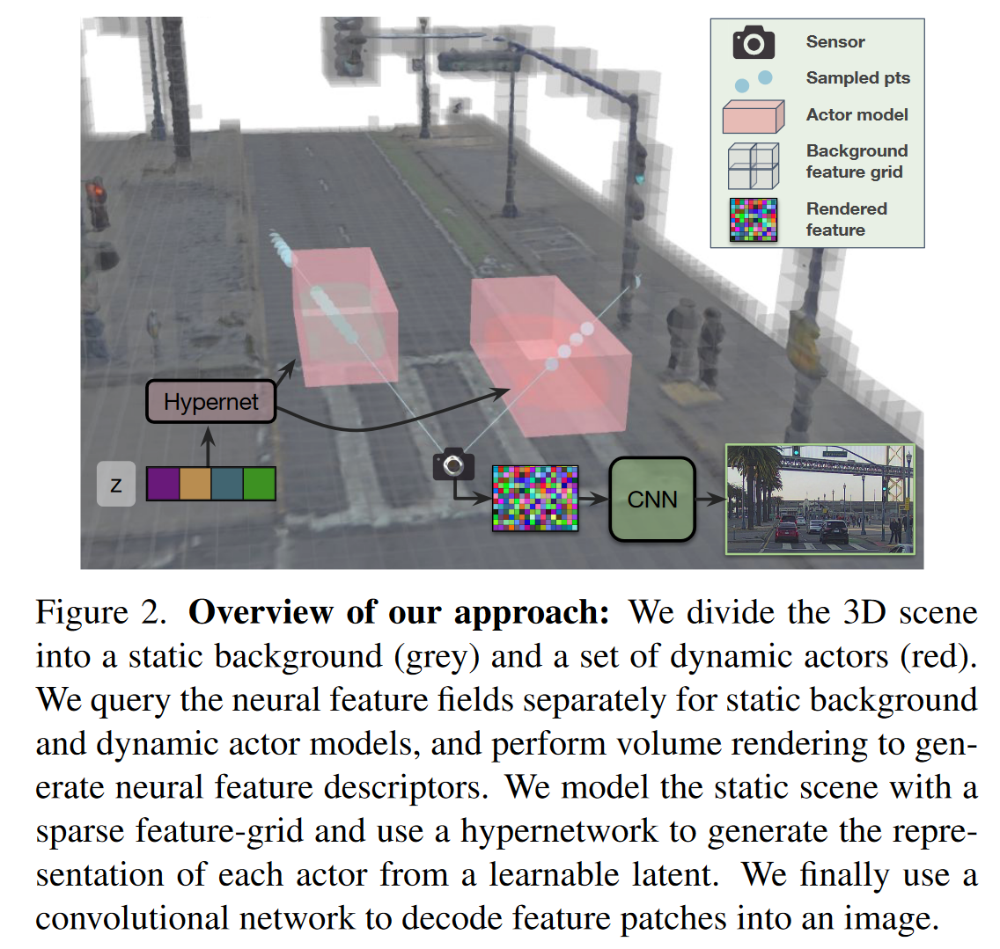

They divide the 3D scene into a static background (grey) and a set of dynamic actors (red). Then query the neural feature fields separately for static background and dynamic actor models, and perform volume rendering to generate neural feature descriptors. We model the static scene with a sparse feature-grid and use a hypernetwork to generate the representation of each actor from a learnable latent. We finally use a convolutional network to decode feature patches into an image

[SurfelGAN: Synthesizing Realistic Sensor Data for Autonomous Driving](https://openaccess.thecvf.com/content_CVPR_2020/html/Yang_SurfelGAN_Synthesizing_Realistic_Sensor_Data_for_Autonomous_Driving_CVPR_2020_paper.html)

**Synthetic Dataset**

Sensor :  LiDAR, RGB

Purpose : Generate realistically looking camera images (**Texture**)

Method : $\text{Surfels}(\text{from LiDAR}) \overset{\text{Surfel GAN}}{\to} \text{Images}(\text{from RGB cam})$

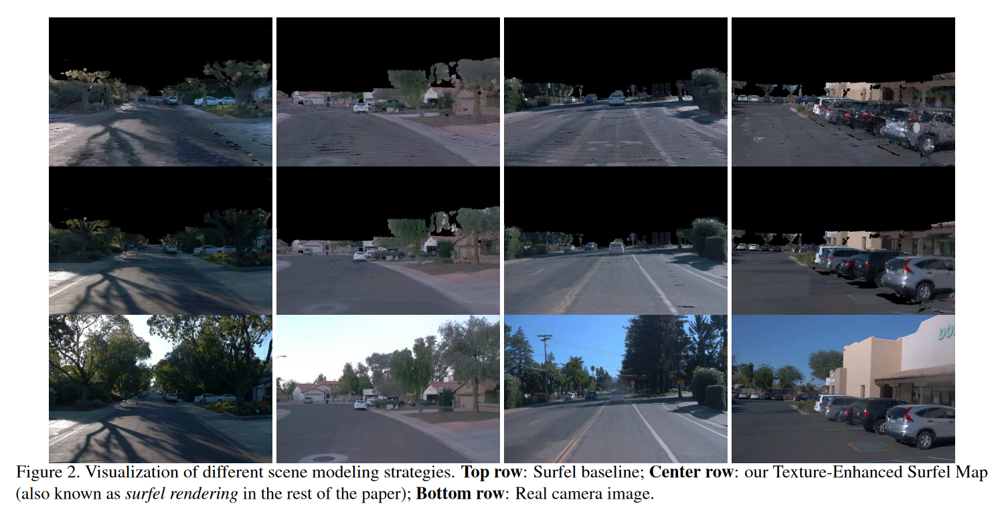

Surfel :  A surfel is a small, oriented disk used to represent a portion of a 3D surface. 

[Real2Sim2Real: Self-Supervised Learning of Physical Single-Step Dynamic Actions for Planar Robot Casting](https://ieeexplore.ieee.org/abstract/document/9811651?casa_token=SxdetTyMKtwAAAAA:bFLA3RhAEgzMdwbqSwBk9a37yYr3Dh356vYt0-nc4cKDooO1vcrk_QDkQPtN7RmlNr1Cxum27Q)

Sensor :  Logitech Brio 4K webcam

Simulator : Issac, PyBullet

Method : 

1. $\mathcal D_{\text{phy}} = \{\text{random real interaction}\}$
2. $\theta_{\text{sim}} = \underset{\theta}{\text{argmin}}(s_{\text{real}},s_{\text{sim},\theta})$
3. $\mathcal D_{sim} = \{\text{random sim interaction}\}$
4. $\pi = \text{Model}(\text{weighted combine}(\mathcal D_{\text{phy}},\mathcal D_{\text{sim}}))$

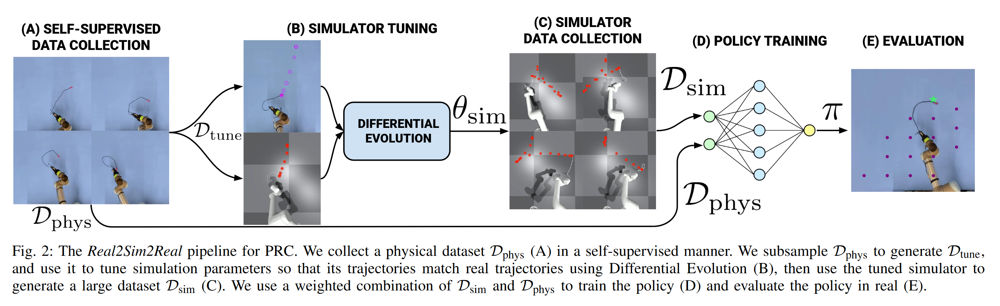

 The Real2Sim2Real framework proposed in this paper is self-supervised  and focuses on efficiently learning a PRC( Planar Robot Casting) policy for different types of  cables. It does so by collecting physical trajectory data, using these  to tune the parameters of a dynamics simulator through Differential  Evolution, and then generating simulated examples. The learning policy  is derived from a weighted combination of both simulated and physical  data. The methodology was tested using three different simulators and  two function approximators (Gaussian Processes and Neural Networks) on  cables with varying physical properties. 

PRC : Planar Robot Casting

[Reinforcement and Imitation Learning for Diverse Visuomotor Skills](https://arxiv.org/pdf/1802.09564.pdf)

Sensor : RGB

a Kinect camera (RGBD) was visually calibrated to match the position and orientation of the simulated camera, and the simulation’s dynamics parameters were manually adjusted to match the dynamics of the real arm.

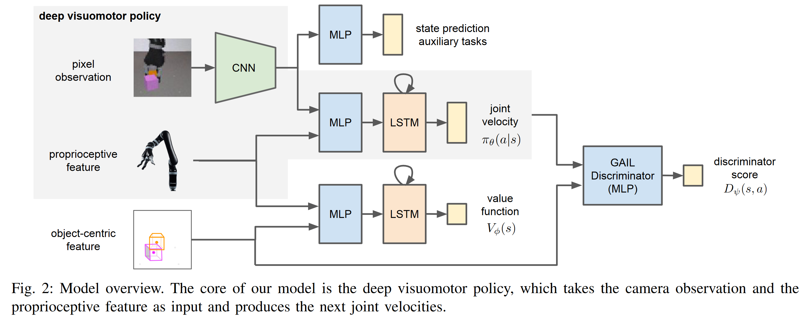

GAIL : [Generative Adversarial Imitation Learning](https://arxiv.org/abs/1606.03476)

## Depth 

**LiDAR** : laser 

**Kinect**: the motion sensing device for the Xbox 360 gaming console. It  provides RGB, Infra-Red (IR), depth, skeleton, and audio streams to an  application

[LiDAR Data Noise Models and Methodology for Sim-to-Real Domain Generalization and Adaptation in Autonomous Driving Perception](https://ieeexplore.ieee.org/abstract/document/9576034?casa_token=GtXRx-HHKN0AAAAA:2Bq5SCP_NTqeJl1R7K-cfTeMTSPpWuJV-XrRJUmiu8uBgiyFJ80YOV4Ogw-UWPpvImDRGmKjhQ)

**Domain randomization**

Sensor : LiDAR

Task : Semantic Segmentation and Object Detection

Method : 
$$
\text{Training Set} = \text{Error Model}(\text{Simulated Data})
$$

$$
\text{Error Model} = \text{Noise Model} + \text{Point Dropout Model}
$$

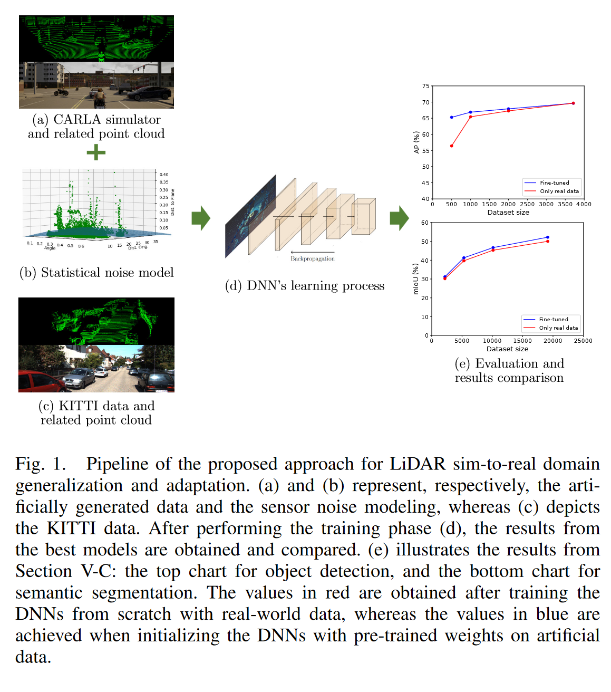

In the learning process of the study, the sensor error modeling is used  to make the simulated LiDAR data more realistic by introducing noise and point dropout, as described by the noise and dropout models. This  process helps in training the neural networks to be more robust to the  imperfections commonly found in real-world LiDAR data. 

[LiDAR Sensor modeling and Data augmentation with GANs for Autonomous driving](https://arxiv.org/pdf/1905.07290.pdf)

**Realistic Simulation**

Sensor : LiDAR

Problem : $\text{Sensor Modeling}\leftrightarrow \text{Image 2 Image Translation(Real LiDAR data} \leftrightarrow \text{Simulation LiDAR data)}$

$$\text{Realistic LiDAR Data}=\text{CycleGAN}(\text{Simulated LiDAR Data},\text{Real-world LiDAR Features})$$

The core of the paper is the formulation of the problem as an  image-to-image translation from unpaired data using CycleGANs. This  approach is used to solve the sensor modeling problem for LiDAR,  enabling the production of realistic LiDAR data from simulated LiDAR  (sim2real) and generating high-resolution realistic LiDAR from lower  resolution data (real2real).

[Unsupervised Neural Sensor Models for Synthetic LiDAR Data Augmentation](https://arxiv.org/pdf/1911.10575.pdf)

**Data Augment**

- Cycle GAN : $\underset{G,F}{\text{argmin}}~\underset{D_X,D_Y}{\text{max}} \mathcal L_{GAN}(G,D_Y,X,Y)+\mathcal L_{GAN}(F,D_X,X,Y)+\lambda[\mathcal L_{R_Y}(G,F,Y)+\mathcal L_{R_X}(F,G,X)]$
  - $X, Y$ : original / real data  
  - $G,F$ : forward/ backward network, $G:X\to Y, F:Y\to X$
  - $D_X,D_Y$ : discriminators 
- NST : $\underset{G}{\text{argmin}}~\underbrace{ \lambda _s\mathcal L_s(p)}_{\text{style loss}}+\underbrace{\lambda_c\mathcal L_c (p)}_{\text{content loss}}$
  - $p$ : generated image

two main neural sensor models (NSMs) for LiDAR data augmentation using synthetic data: CyclGAN and Neural Style Transfer (NST).

[Towards Zero Domain Gap: A Comprehensive Study of Realistic LiDAR Simulation for Autonomy Testing](https://openaccess.thecvf.com/content/ICCV2023/html/Manivasagam_Towards_Zero_Domain_Gap_A_Comprehensive_Study_of_Realistic_LiDAR_ICCV_2023_paper.html)

**gap evaluation, Simulation Enhancement**

Reality Problems:

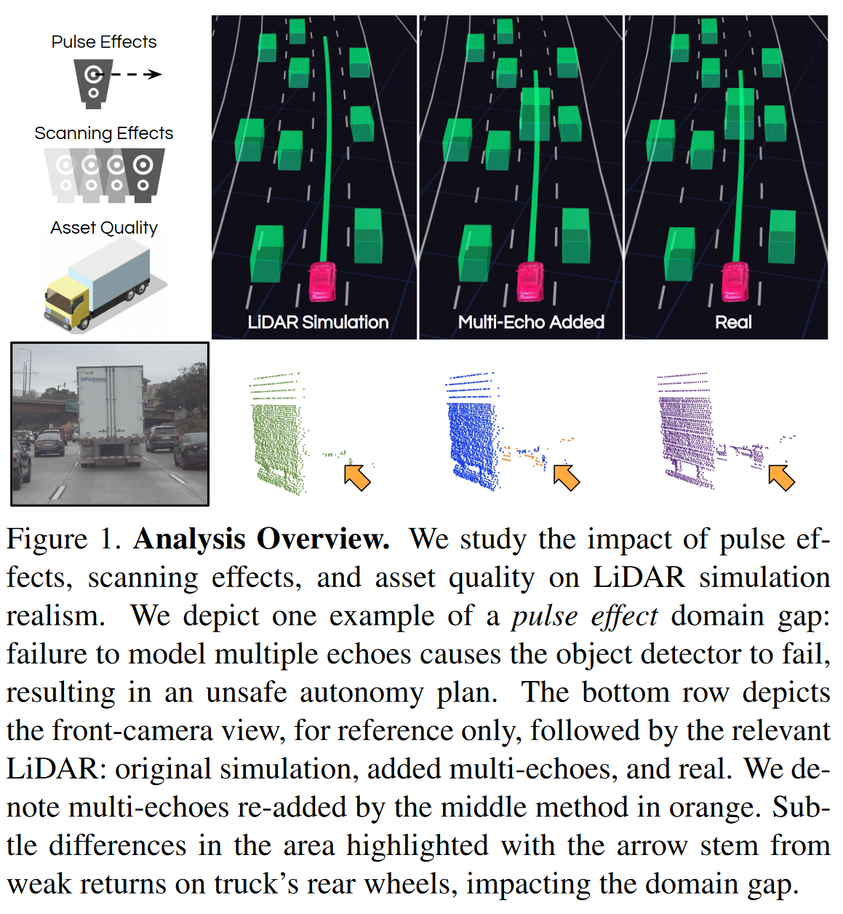

Domain Gap:

Modeling Phenomenons:

- drop points (pulse amplitude too low $\frac{1}{R^4}$)
- add points (different  surface,...)
- spurious points (beam divergance, ...)
- noisy points (peak in waveform is ambiguous)

[Characterizations of Noise in Kinect Depth Images: A Review](https://ieeexplore.ieee.org/document/6756961)

- noise models of Kinect 
  - geometric of Pin-Hole Cameral Models
  - Empirical Models
  - Statistical Noise Models
- characterization of Kinect noise
  - Spatial Noise
  - Temporal Noise
  - Inference Noise

[Sim2Real2Sim: Bridging the Gap Between Simulation and Real-World in Flexible Object Manipulation](https://ieeexplore.ieee.org/abstract/document/9287921?casa_token=qKgRLYO7UP4AAAAA:YlgsFqqgCWHFbMZ9idWOA8zWcylL5jz-gZU_uSJ52OVkh1FoJ3-Sabbqj37i88a1dttBUBuIHQ)

**visual feedback**

Simulator : Gazebo 

Task :  DRC Plug Task

Method : 

- real world : visual servoing approach to align the cable-tip pose with the socket pose.
- simulation : Recursive Newton Euler

    $$
    \underset{K,D}{\text{argmin}}\Vert M\ddot {\textbf q}  +C\dot{\textbf q} + G  + J^\top \textbf f_{\text{ext}} + K\textbf q + D\dot  {\textbf q}-\tau\Vert
    $$

    - $K$ : stiffness 
    - $D$ : Damping
    - $M$ : inertia matrix
    - $C$ : centrifugal and Coriolis forces
    - $G$ : gravitational forces or torque
    - $\tau$ : joint torque

Sensor : Kinect(RGBD)

Novelty : optimize simulation from real

Sim2Real2Sim adds an essential step of feedback and refinement.
What makes Sim2Real2Sim innovative is its additional phase of refining the simulation models based on real-world data and experiences. After the initial transfer from simulation to the real world, the observed differences and inaccuracies in the real-world application are used to update and improve the simulation models. This process creates a feedback loop where the simulation continuously evolves and becomes more accurate and representative of the real world.

## IMU

[Sim-to-Real Strategy for Spatially Aware Robot Navigation in Uneven Outdoor Environment](https://arxiv.org/pdf/2205.09194.pdf)

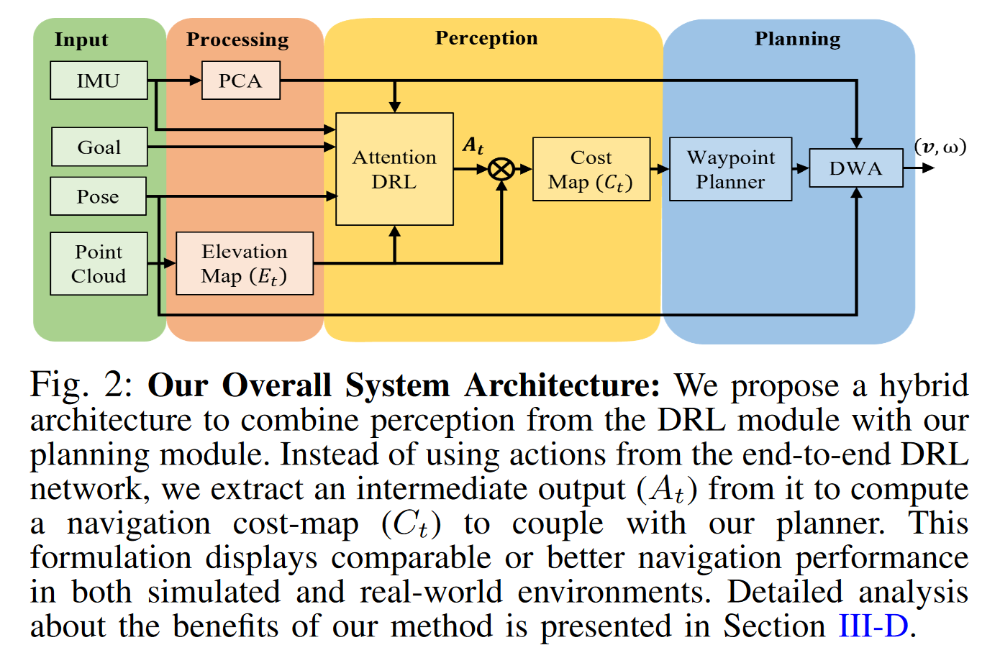

- point cloud is gained from LiDAR

- DWA: Dynamic Window Approach to penalize velocities that could cause robot flip-overs
- IMU is processed by PCA

[Policies Modulating Trajectory Generators](http://proceedings.mlr.press/v87/iscen18a/iscen18a.pdf)

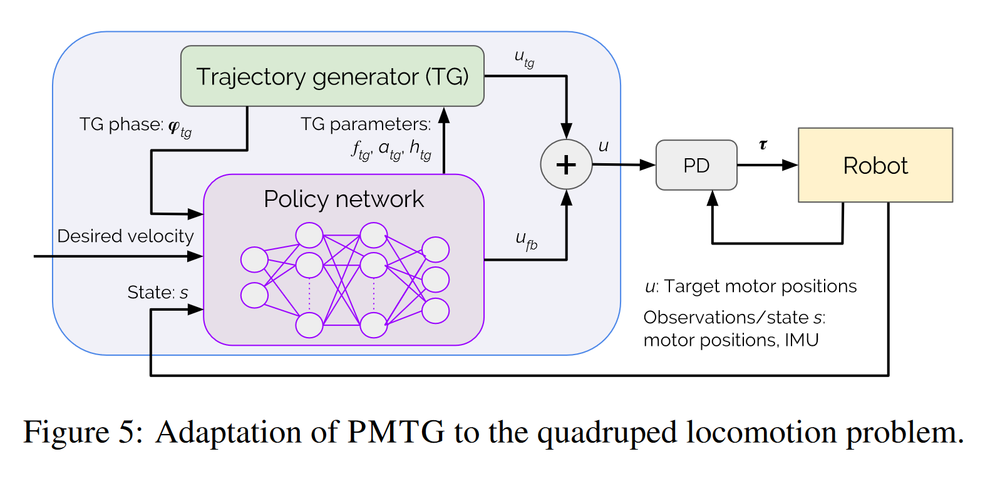

**IMU as modal for policy (only IMU + motor position)**

[Vision-Guided Quadrupedal Locomotion in the Wild with Multi-Modal Delay Randomization](https://ieeexplore.ieee.org/abstract/document/9981072?casa_token=QP7Zmn7hYbsAAAAA:hhPNopnwtBtvhhEm7JPqv8P8qgVfKUbPZccjQOrnONs9ZFfCg08QyVD8xg7o1PmPp-8GPuBpqA)

**IMU as modal input for policy**

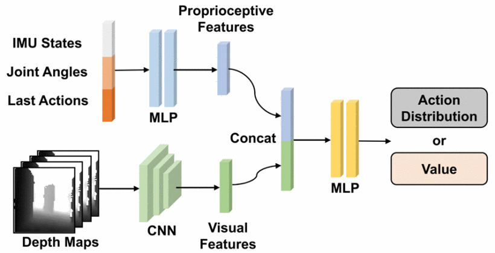

[Zero-Shot Policy Transferability for the Control of a Scale Autonomous Vehicle](https://arxiv.org/pdf/2309.09870.pdf)

**IMU for error estimation**
$$
\text{IMU signal}\to \text{heading} \to \text{error state}\to NN\to\text{left/right control}
$$

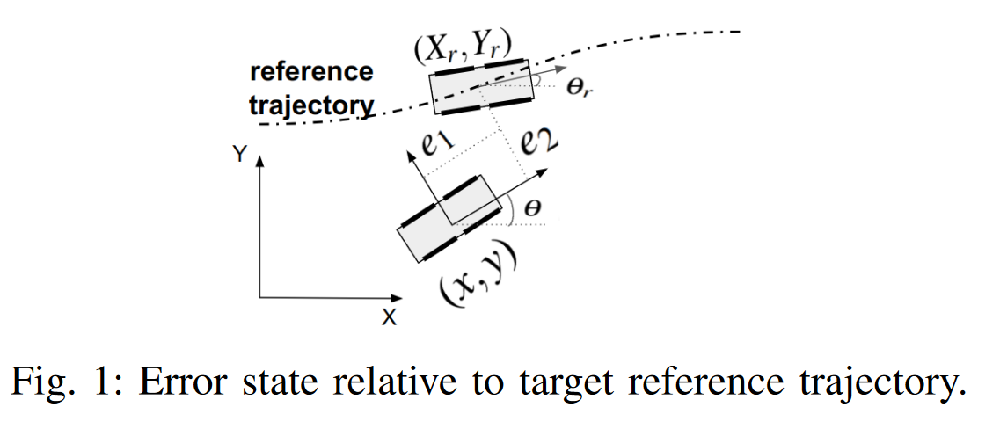

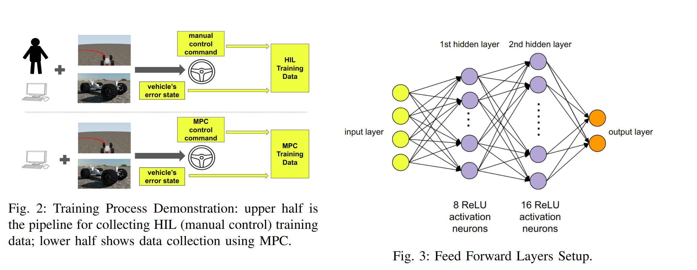

[Learning Autonomous Mobility Using Real Demonstration Data](https://ieeexplore.ieee.org/abstract/document/9659394?casa_token=EBmmJwSObMkAAAAA:6377wLVFYOdx3EHzC7AzjvkidsD4o7gldrUkoS2VA2waQXM6fflUxgRLAGVWhpeZrgzx7e2Zew)

**Time sequence IMU modeling with NN**

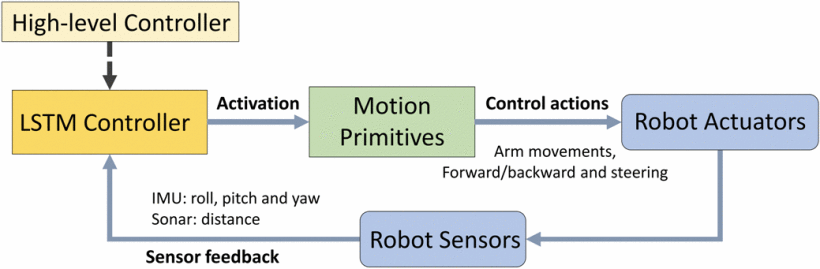

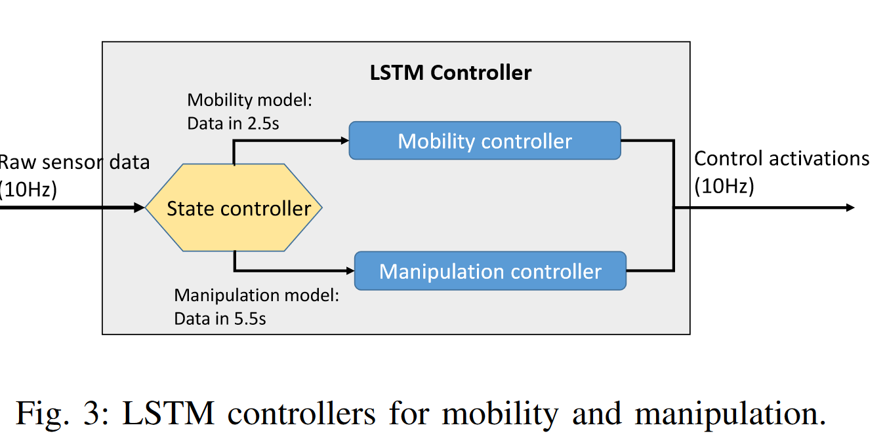

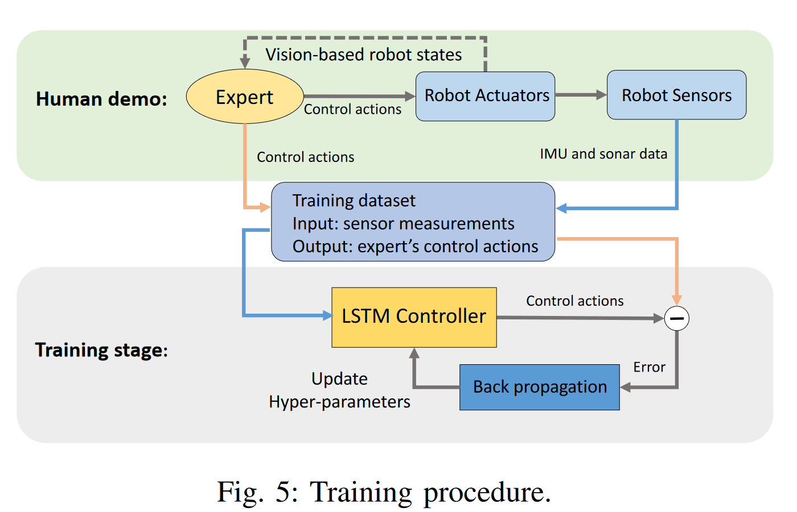

## Force Sensor 

Single-point contact sensor : 

- measure contact force : ATI Nano 17 force-torque sensor
- measure vibration : [biomimetic](https://www.sciencedirect.com/topics/engineering/biomimetics) whiskers

Tactile Array: fiber optics, [MEMS](https://www.sciencedirect.com/topics/engineering/microelectromechanical-system) barometers, RoboTouch, DigiTacts

optical tactile sensor, high resolution : GelSight, GelTip, TacTip, DIGIT

[Robotic tactile perception of object properties: A review](https://www.sciencedirect.com/science/article/pii/S0957415817301575)

[Touch driven controller and tactile features for physical interactions](https://www.sciencedirect.com/science/article/pii/S0921889019300697)

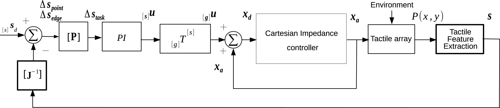

$$
\text{Physical Contact}\to J^{-1}\to \text{Controller}
$$

Inverse of Jacobian $J^{-1}$ is calculated by the contact pattern 

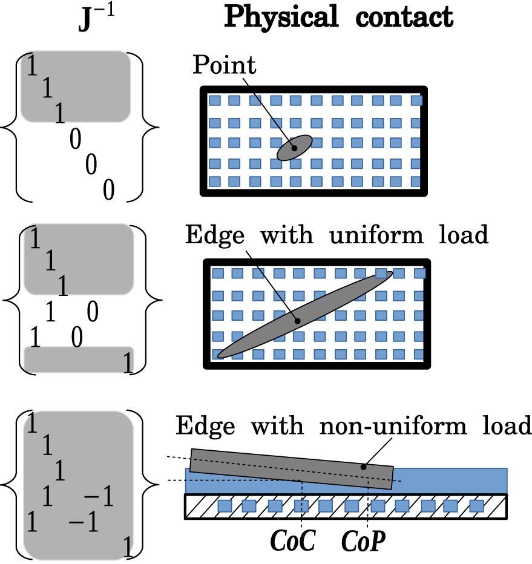

[Generation of GelSight Tactile Images for Sim2Real Learning](https://ieeexplore.ieee.org/abstract/document/9369877?casa_token=ehYPCQyDqY8AAAAA:PSDK3P4CkVv8Rx8KoZ7epXnfedT-dCEQrPP4cqsJ6HcZ3fB4rV8lVKbL0F7zHNGfBhyURpMIwA)

sensor : GelSight

simulator : Gazebo 
$$
H_{\text{GelSight}}=\text{GF}(H_{\text{truth}})
\\
\text{RGB} = \text{Phong}(H_{\text{GelSight}})
$$
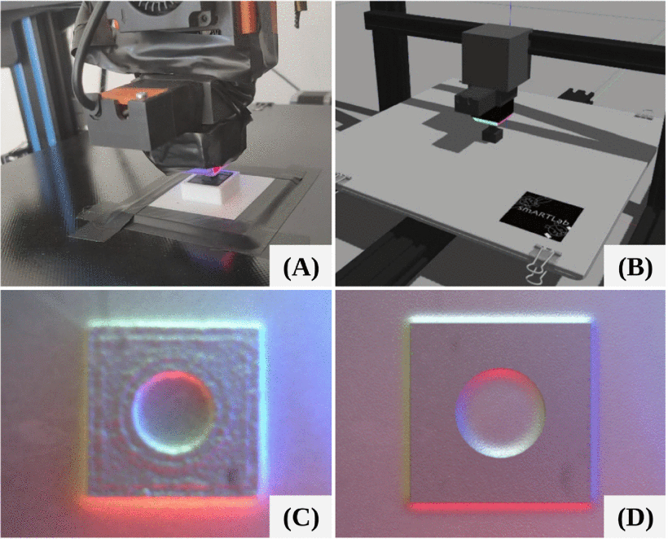

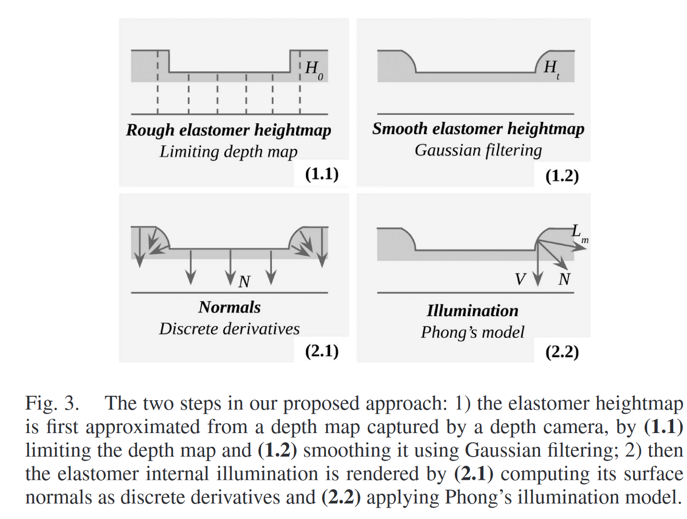

[Learning the sense of touch in simulation: a sim-to-real strategy for vision-based tactile sensing](https://ieeexplore.ieee.org/abstract/document/9341285?casa_token=2TdboohxzDMAAAAA:rQUYejq_kpeVCCf1tLGnMkkWQ8jK3Bytvo-obSKDyUddjPq2EoKqJlmCiQABTVRaDLOUuHD_YA)

FEM solution also considered as ground truth

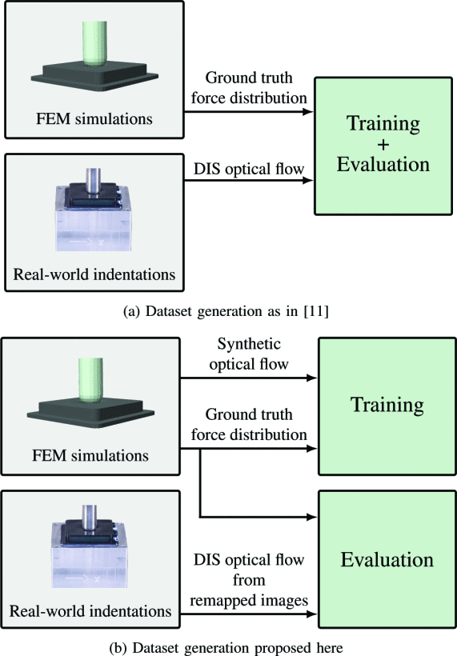

figure a is corresponding to paper "[Ground Truth Force Distribution for Learning-Based Tactile Sensing: A Finite Element Approach](https://ieeexplore.ieee.org/document/8918082)"

DIS: Dense Inverse Search ([Fast Optical Flow using Dense Inverse Search](https://arxiv.org/abs/1603.03590))

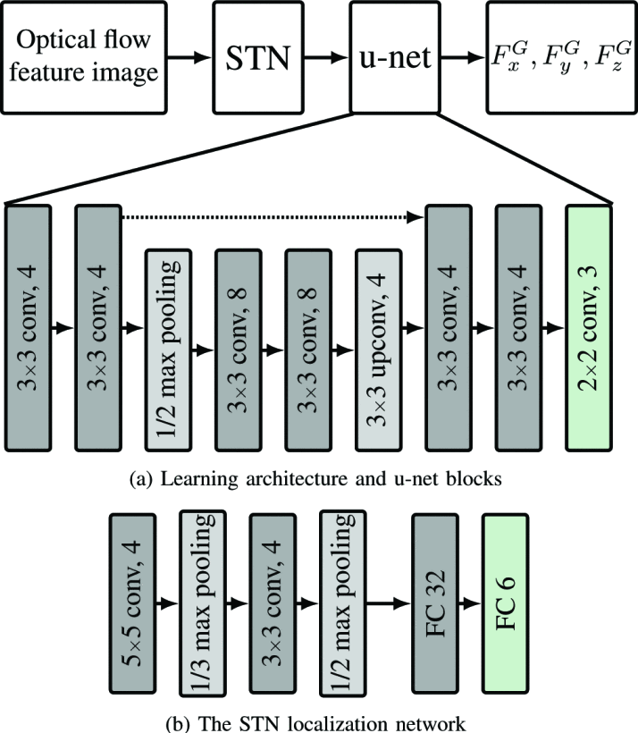

[Skill generalization of tubular object manipulation with tactile sensing and Sim2Real learning](https://www.sciencedirect.com/science/article/pii/S092188902200210X?casa_token=iXRiFodccmcAAAAA:0Gts_R0rgC4aer0a_ghwW0dTd8lg13CE7jsT8bdY4MWXC6DzC798qknY9EQmrMBfIh7PdBcWVA)

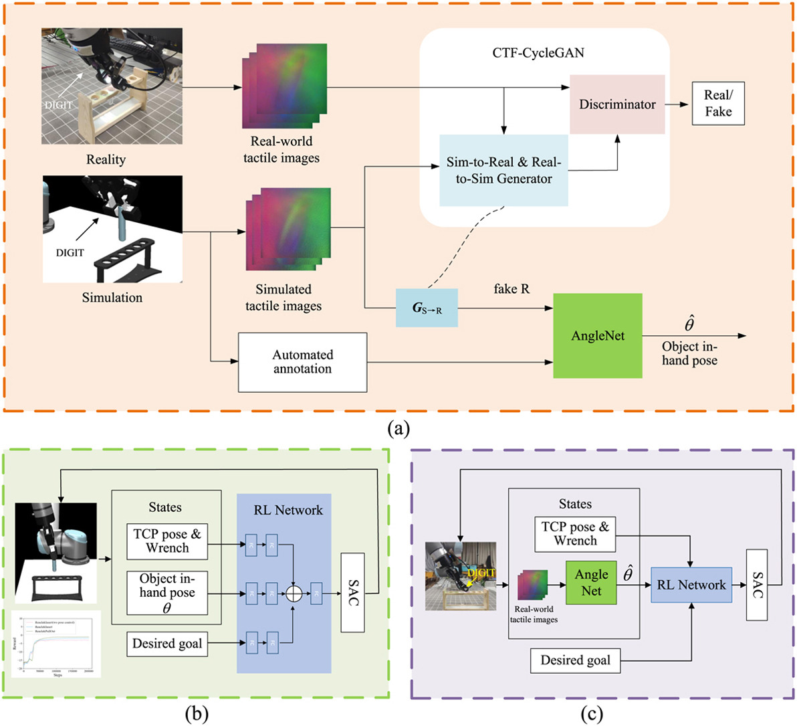

purpose: learning Sim2Real transferable robotic insert-and-pullout actions

sensor: optical tactile sensors（DIGIT sensor)

CTF-CycleGAN: CNN + Transformer CycleGAN

Angle Net : cnns

SAC: [Soft Actor-Critic](http://proceedings.mlr.press/v80/haarnoja18b/haarnoja18b.pdf)

TCP : Tool Center Point

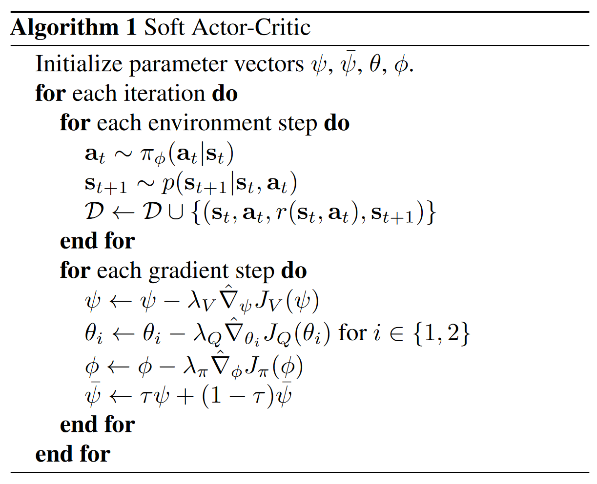

Wrench: The wrench reading of the robot is used to determine whether there are problems such as failure to insert and jamming

[Sim-to-Real for Robotic Tactile Sensing via Physics-Based Simulation and Learned Latent Projections](https://ieeexplore.ieee.org/stamp/stamp.jsp?tp=&arnumber=9561969)

sensor: BioTac, single point pressure sensor

$E(\text{Young's modulus}),\mu(\text{friction}),\nu(\text{poisson ratio})$ are free parameters

same indentation are applied in simulation

simulation: linear elasticity FEM

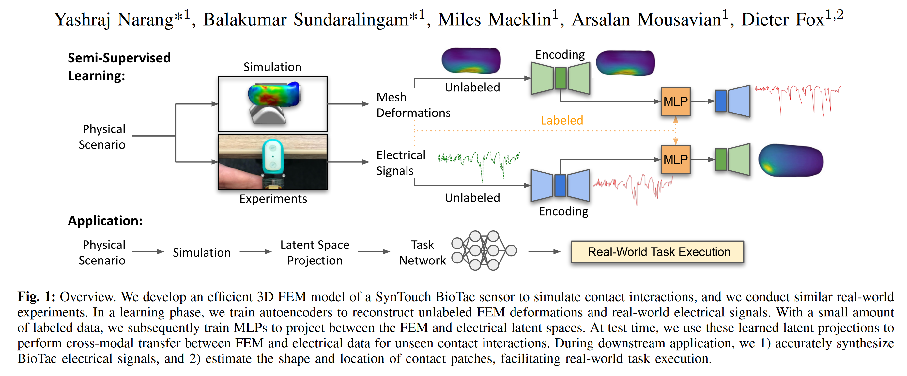

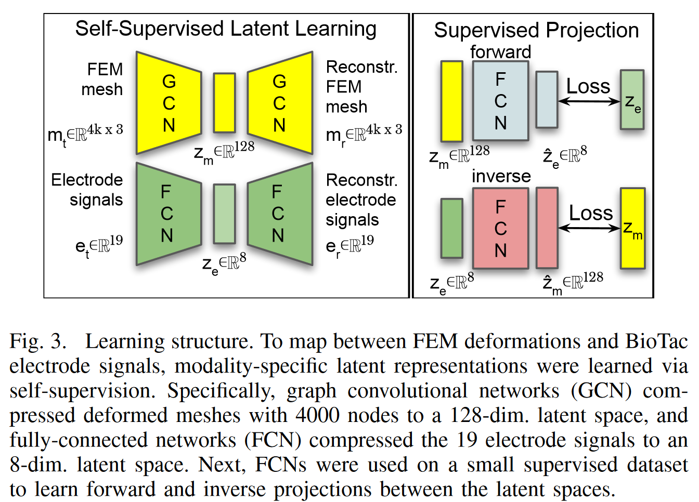

## Encoders

[Control Transformer: Robot Navigation in Unknown Environments
through PRM-Guided Return-Conditioned Sequence Modeling](https://arxiv.org/pdf/2211.06407.pdf)

encoders and IMU are used to calculate current position $x_t$
$$
g_t = w_t - x_t
$$
where $w_t$ is the closest waypoint not yet reached at current timestep
$$
V_{\phi}(s_t|g_t)
$$

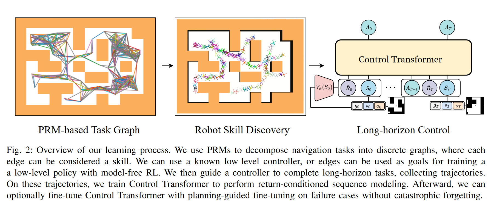

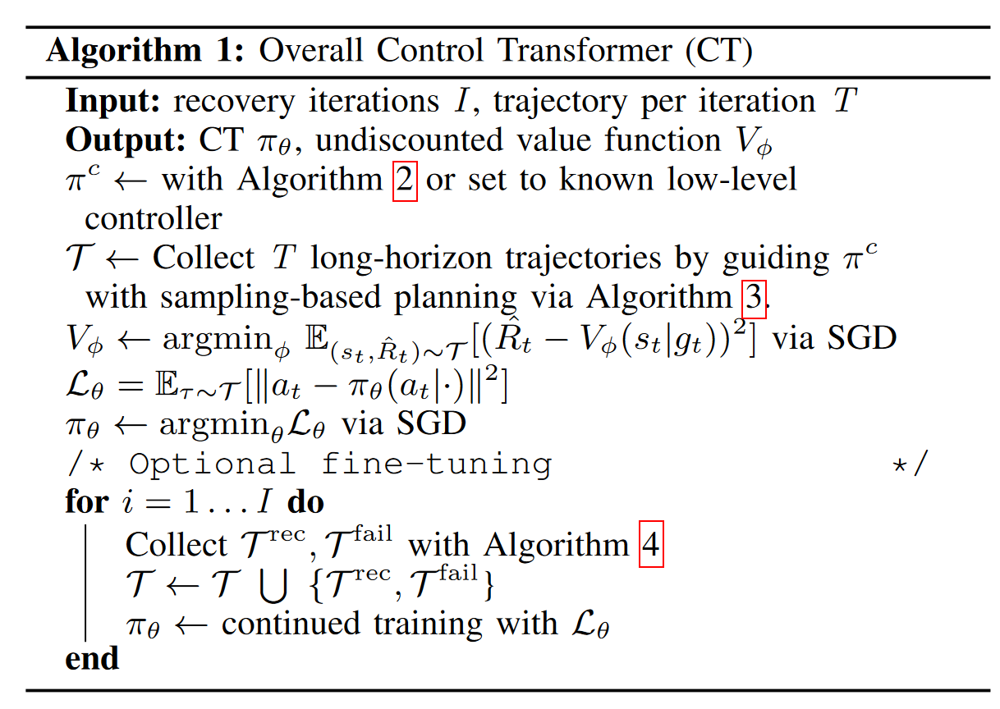

[NeuronsGym: A Hybrid Framework and Benchmark for Robot Tasks with Sim2Real Policy Learning](https://arxiv.org/pdf/2302.03385.pdf)
$$
\tilde \omega_i (t) = \omega_i(t) + n^e,n^e\sim\mathcal N(\mu_e, \sigma_e)
$$
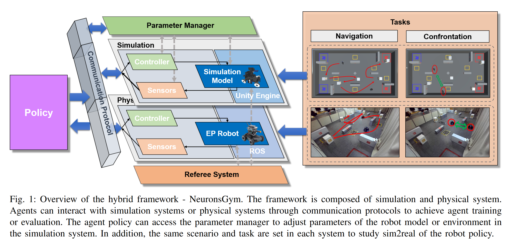

[LiDAR SLAM with a Wheel Encoder in a Featureless Tunnel Environment](https://www.mdpi.com/2079-9292/12/4/1002)

use wheel encoder to correct the LiDAR data, but not related to simulation

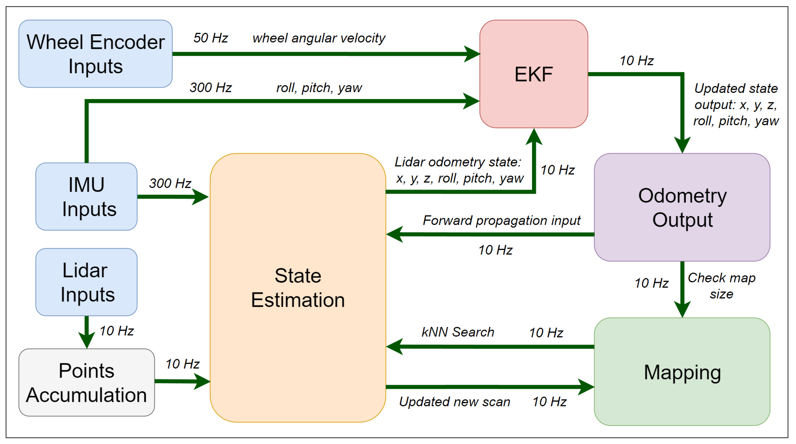

EKF : extended Kalman Filter

[http://conference.ioe.edu.np/ioegc2014/papers/IOE-CONF-2014-66.pdf](http://conference.ioe.edu.np/ioegc2014/papers/IOE-CONF-2014-66.pdf)

